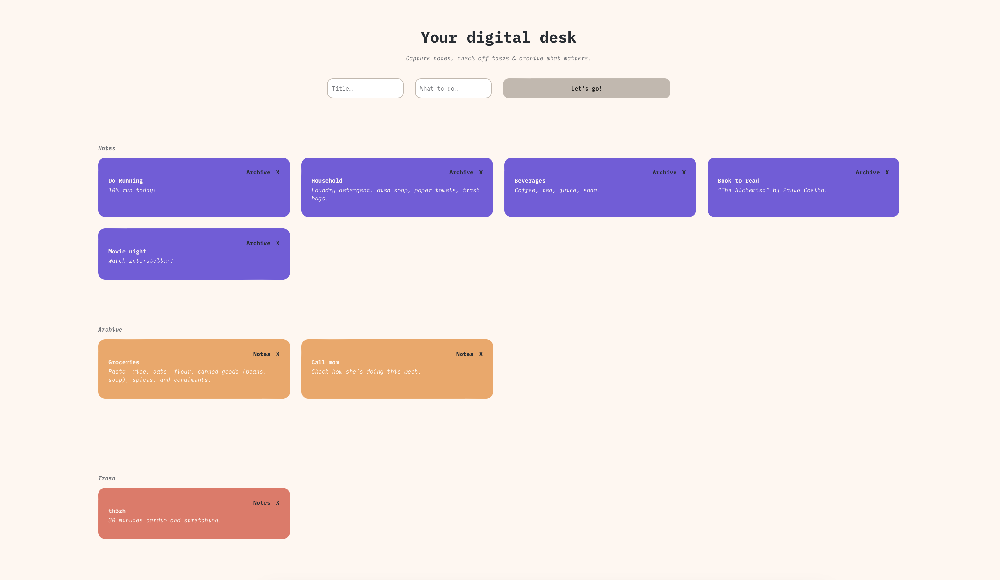

# Your Digital Desk – Simple Note App

A lightweight note-taking app where you can create, archive, and manage notes with just a title and content. Built with pure HTML, CSS, and JavaScript – no frameworks required.

## Overview

### Features

Users can:

- Add notes with a title and description
- Move notes between Notes, Archive, and Trash
- Delete notes permanently
- Enjoy persistent storage via LocalStorage
- Use the app seamlessly on different screen sizes thanks to responsive design

### Screenshot

### Links

- Solution URL: [GitHub Repository](https://github.com/stefanstraeter/tiny-notes)
- Live Site URL: [Live Demo](https://stefanstraeter.github.io/tiny-notes/)

## My process

### Built with

- Semantic HTML5 markup – structured and accessible elements
- CSS variables & custom properties – consistent theming and easy adjustments
- Responsive CSS Grid & Flexbox – adaptive layouts across devices
- Vanilla JavaScript (ES6) – for DOM manipulation and app logic
- LocalStorage API – persisting notes across browser sessions

### Key learnings

This project helped me strengthen my skills in:

- Building a clean and semantic HTML foundation for accessibility
- Creating a modular and scalable CSS setup with variables and utility classes
- Designing responsive layouts with Grid and Flexbox that scale from mobile to desktop
- Implementing a functional notes system in plain JavaScript, including:
- Dynamic rendering of notes
- State management with arrays
- Data persistence with LocalStorage
- Interactive UI with event listeners and template rendering

## Author

- GitHub: [stefanstraeter](https://github.com/stefanstraeter)
